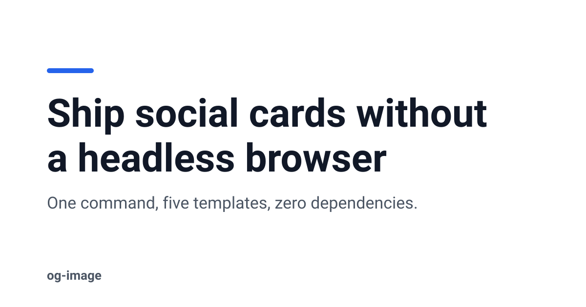
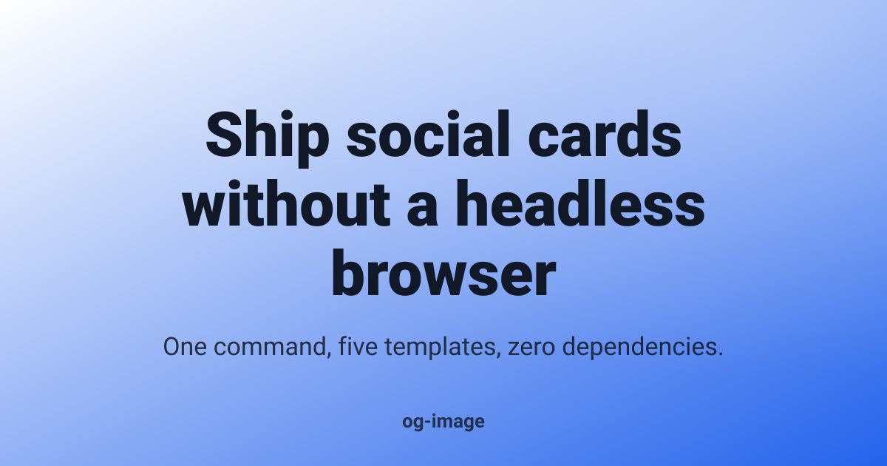
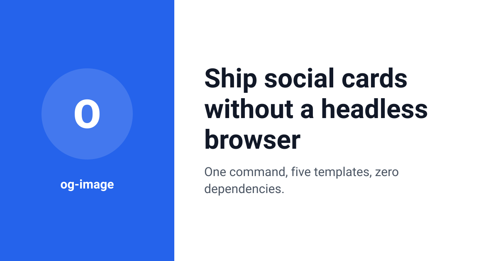
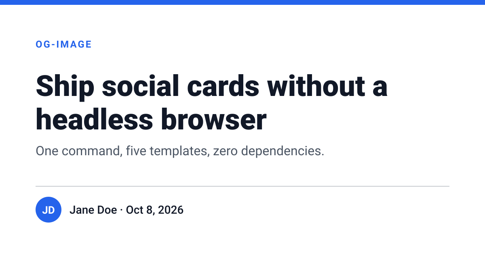
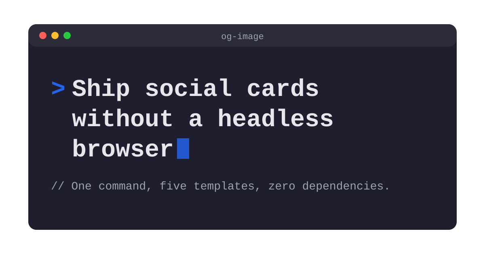

# og-image

Generate 1200×630 social preview images (Open Graph / Twitter cards) from a title and a template. It outputs SVG, and PNG when a rasterizer is installed. No dependencies.



- 5 templates: `minimal`, `gradient`, `split`, `blog-post`, `code-style`
- Light and dark themes, custom background, text and accent colors
- Text wrapping based on a per-character width table for a system sans font, with automatic font-size fitting, line clamping and an ellipsis
- Escapes all text as XML, so titles like `<script>` & "quotes" are safe
- PNG output through whichever tool you already have: `rsvg-convert`, ImageMagick (`magick` / `convert`), Inkscape, or headless Chromium/Chrome

## Install

```sh
npm install -g og-image      # or: npx og-image ...
```

Requires Node 18.3+.

## CLI

```sh
og-image --title "Ship social cards without a headless browser" \
         --subtitle "One command, five templates, zero dependencies." \
         --template gradient --theme dark --accent "#f97316" \
         --out card.svg --png
```

| Option | Description |
| --- | --- |
| `--title <text>` | Title (required) |
| `--subtitle <text>` | Subtitle or description |
| `--template <name>` | `minimal` (default), `gradient`, `split`, `blog-post`, `code-style` |
| `--theme light\|dark` | Base palette (default `light`) |
| `--bg`, `--fg`, `--accent <#hex>` | Override colors. If you set `--bg` without `--fg`, the text color is picked to contrast with it |
| `--author`, `--date` | Author and date for `blog-post` |
| `--site <text>` | Site name or label (footer, side panel or editor tab, depending on the template) |
| `--out <file>` | `.svg` or `.png` output. Without it, the SVG is printed to stdout |
| `--png` | Also write `<out>.png` next to the SVG |
| `--list-templates` | List the templates |
| `--list-rasterizers` | Show which PNG tools were detected |

### PNG output

PNG output needs an external rasterizer. og-image tries these in order and uses the first one that works:

1. `rsvg-convert` (librsvg, e.g. `brew install librsvg`, `apt install librsvg2-bin`)
2. ImageMagick `magick` or `convert` (only works if ImageMagick has an SVG delegate)
3. `inkscape`
4. A Chromium-family browser, found through `CHROME_PATH`, `CHROMIUM_PATH` or `PUPPETEER_EXECUTABLE_PATH`, then on `PATH` (`chromium`, `google-chrome`, `headless_shell`, ...), then in a Playwright browser cache (`PLAYWRIGHT_BROWSERS_PATH` or `~/.cache/ms-playwright`)

If none is available or all of them fail, the SVG is still written, but the command prints the reason for each failure and exits with code 1.

## API

```js
import { renderOgImage } from 'og-image';
import { svgToPng } from 'og-image/rasterize';
import { writeFileSync } from 'node:fs';

const svg = renderOgImage({
  title: 'How we cut build times in half',
  subtitle: 'Caching, parallelism and one weird flag',
  template: 'blog-post',
  theme: 'light',
  accent: '#7c3aed',
  author: 'Jane Doe',
  date: 'Oct 8, 2026',
  site: 'engineering blog',
});
writeFileSync('card.svg', svg);
svgToPng(svg, 'card.png', { width: 1200, height: 630 }); // throws if no rasterizer
```

The text helpers are also exported: `wrapText(text, { fontSize, maxWidth, maxLines, bold, mono })` returns `{ lines, truncated }`. The module also exports `fitText`, `measureText`, `ellipsize`, `escapeXml` and `TEMPLATES`.

## Templates

| | |
| --- | --- |
| `minimal`  | `gradient`  |
| `split`  | `blog-post`  |
| `code-style`  | |

## Notes

- Text is measured with an approximate width table (Helvetica/Arial metrics), not real font shaping. Wrapping is close to what browsers render with `system-ui`, but not pixel-exact. The layouts leave some slack to absorb the difference.
- Social networks don't accept SVG for `og:image`. Use `--png` (or convert the SVG some other way) before publishing.

## License

MIT © 2026 ghanemja
